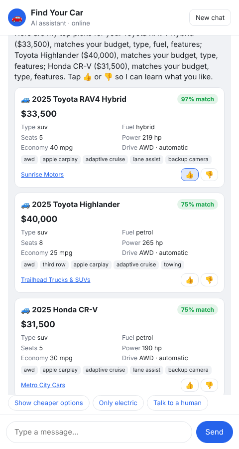
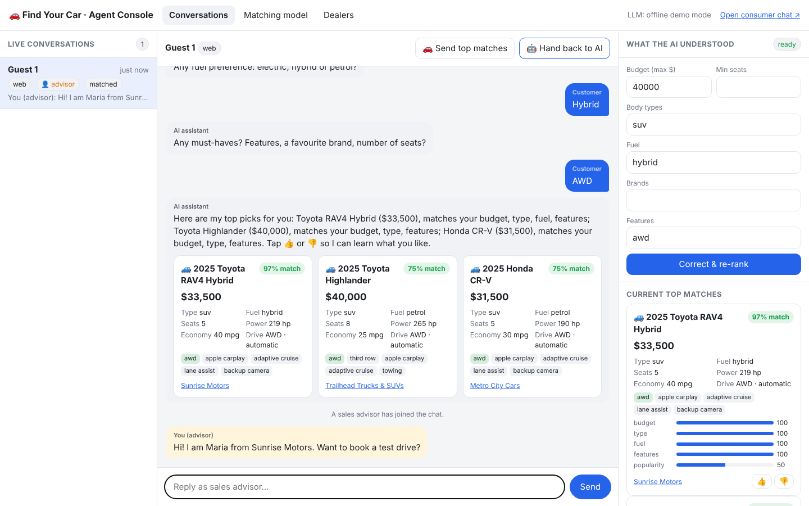
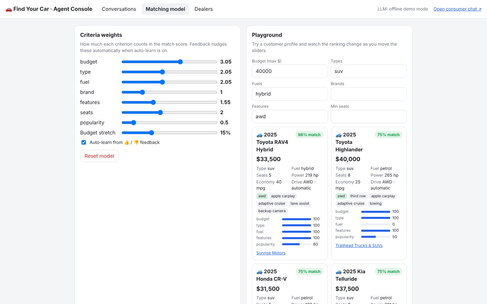

# 🚗 Find Your Car

An AI car-recommender chat assistant for a car retailer. It asks friendly questions about budget, body type, fuel, brand and must-have features, then recommends the best cars from inventory with full specs. It's powered by an LLM through **CodeMie**.

Built to stay simple: **plain Node.js with zero dependencies** (no `npm install`, no build step, no database).

| Consumer chat | Agent console (takeover) |
|---|---|
|  |  |

## Quick start

```bash
cp .env.example .env     # add your CodeMie URL + key (optional, see below)
npm start                # or: node server.js
```

- Consumer chat: http://localhost:3000/
- Agent / admin console: http://localhost:3000/agent.html

With no LLM configured, the app runs in **offline demo mode**: a small rule-based parser drives the same flow. A demo still works if Wi-Fi or the API key fails.

### Connecting CodeMie

CodeMie exposes its models through an OpenAI-compatible chat-completions endpoint. Put the base URL, an API key and the model name from your CodeMie workspace in `.env`:

```
CODEMIE_API_URL=https://<your-codemie-host>/<llm-proxy-path>   # the app calls {URL}/chat/completions
CODEMIE_API_KEY=...
CODEMIE_MODEL=gpt-4o          # or any model your CodeMie project offers
```

The console's top bar shows which mode is active. Any other OpenAI-compatible gateway works the same way.

## The three requirements

### 1. Swappable chat interface (web → WhatsApp / Telegram / Messenger)

The assistant never knows which app the user is on. A **channel adapter** is a plain object (`src/channels/index.js`):

```
inbound:  assistant.handleIncoming({ channel, externalId, name, text })
outbound: listen to bus 'message' events for your channel and deliver bot/agent messages
```

Two adapters ship today:
- `web.js`: the built-in chat page (HTTP POST + Server-Sent Events).
- `telegram.js`: set `TELEGRAM_BOT_TOKEN` and the **same bot and console** also work in Telegram (long polling, so no public URL needed). Recommendations render as text, and quick replies become a Telegram keyboard.

WhatsApp (Meta Cloud API / Twilio) or Messenger means copying `telegram.js` and swapping its two HTTP calls.

### 2. Two views: consumer and agent takeover

- **Consumer** (`/`): mobile-first chat with quick-reply chips, car cards with specs, and 👍/👎 buttons.
- **Agent console** (`/agent.html`): live list of every conversation on every channel, updating in real time.
  - **Take over / hand back**: while an agent drives, the AI stays quiet. The customer sees "A sales advisor has joined".
  - **Handoff requests**: a customer typing "talk to a human" gets flagged 🔔 in the list.
  - **"What the AI understood"**: the extracted preferences, editable. The agent can fix a misunderstanding and re-rank.
  - **Send top matches**: pushes recommendation cards into the chat while in takeover mode.

### 3. Interactive, self-improving matching model



Matching is a **transparent weighted score** (`src/core/matcher.js`). The LLM handles the conversation; the ranking stays explainable:

```
score = Σ weight × match(criterion)  /  Σ weight      (only criteria the customer mentioned)
```

- Every card shows a **score breakdown** (budget / type / fuel / brand / features / seats / popularity).
- **Sliders** in the console change the weights live, and a **playground** re-ranks a sample profile as you drag.
- **Learning from feedback**: each 👍/👎 (from customers or agents) moves that car's *popularity boost*. With auto-learn on, it also nudges the weights of the criteria the car did or didn't satisfy, so the model adapts to what customers actually like.
- "Reset model" restores the defaults. State is saved in `data/model.json`.

### Bonus: dealer management

Every car belongs to a dealer. The **Dealers** tab lets an admin **add, edit, block/unblock and delete** dealers. **Blocked dealers' cars disappear from recommendations immediately.** Each dealer has a public page (`/dealer.html?id=...`) with contact details and stock; car cards link to it.

There are six seeded dealers (`data/dealers.seed.json`). *Coastline Auto Group* starts **blocked**, so you can unblock it during the demo and watch its Hyundai/Kia stock appear. `npm run reset` restores the seed data and model.

## How a conversation works

```
user message ─► channel adapter ─► assistant.handleIncoming
                                     │  agent took over? → stay quiet
                                     ▼
                          LLM: extract preferences + next question (JSON)
                                     │  enough info / user asks?
                                     ▼
                          matcher.rank(prefs)  → top 3 (active dealers only)
                                     ▼
                          LLM: short personal pitch  +  spec cards
                                     ▼
                bus 'message' ─► channel adapter ─► user   (and live to the agent console)
```

## Project layout

```
server.js                 HTTP server, agent/admin API, wiring
src/core/assistant.js     conversation brain (LLM prompts + offline fallback)
src/core/matcher.js       weighted scoring, feedback learning, tunable weights
src/core/llm.js           CodeMie / OpenAI-compatible client
src/core/conversations.js in-memory store + event bus
src/core/dealers.js       dealer CRUD + block
src/channels/             web.js, telegram.js (+ the adapter contract)
public/                   consumer chat, agent console, dealer page (vanilla JS)
data/                     cars.json (38 cars), dealers.seed.json
```

## Demo script (≈5 min)

1. Open the **consumer chat** and the **agent console** side by side.
2. As the customer, tap *A family SUV* → *Up to $40k* → *Hybrid* → *AWD*. Cards appear with specs, match % and dealer.
3. In the console, the conversation updated live. Show **What the AI understood** and the **score breakdown**.
4. 👍 a car as the customer, then open **Matching model**: the boost and weights moved, and the feedback log shows it.
5. Drag the *fuel* slider to 0 and watch the playground re-rank.
6. Customer types *"can I talk to a human?"* → 🔔 in the console → **Take over** → reply as the advisor → **Hand back to AI**.
7. **Dealers**: in the playground (hybrid SUV, $40k) note the ranking, then unblock *Coastline Auto Group*: the Hyundai Tucson Hybrid jumps in. Block it again and it is gone. Open a dealer page.
8. (Optional) Message the Telegram bot: same assistant, and the conversation appears in the same console.

## Deliberately out of scope (next steps)

- Persistence for conversations (in-memory now). Swap `conversations.js` for Redis/Postgres.
- Real auth for the console (a shared `ADMIN_TOKEN` is supported now).
- Inventory upload/CRUD per dealer, images, financing calculator.
- WhatsApp/Messenger adapters (same contract as Telegram).
